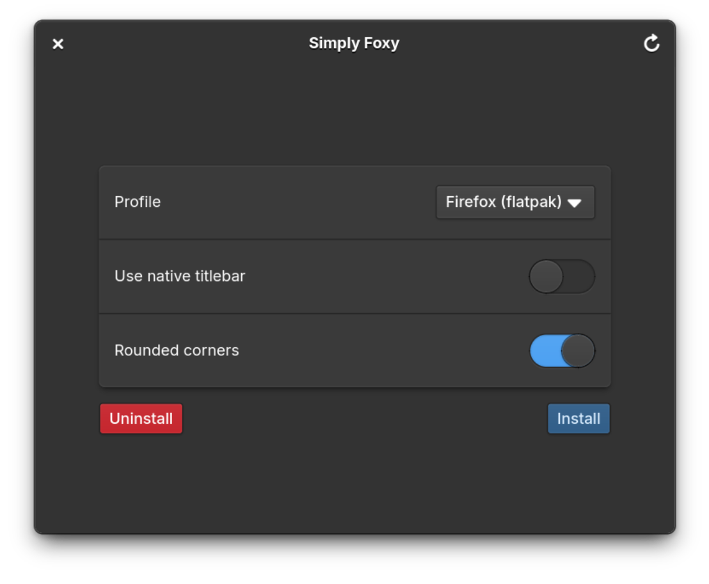

# Simply Foxy



Simple gui installer for [elementary OS Firefox Theme](https://github.com/Zonnev/elementaryos-firefox-theme) with some additional options on top. Written in C++ using [peel](https://gitlab.gnome.org/bugaevc/peel).

# Building from source
## Flatpak

```
flatpak install --include-sdk io.elementary.Platform/x86_64/daily
flatpak install org.flatpak.Builder
flatpak run org.flatpak.Builder --force-clean --install --user .flatpak io.github.garaevdi.simplyfoxy.yml
```
